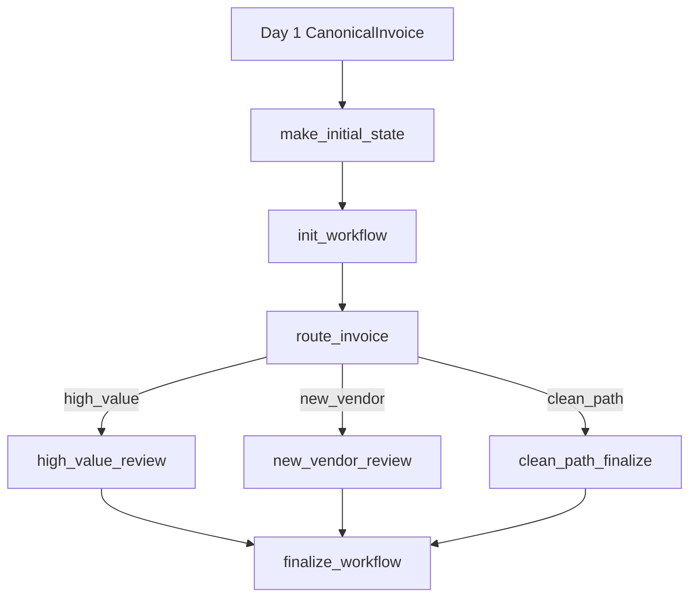

# Day 2 — Stateful Control Flow

## Purpose

Day 2 starts from the existing Day 1 `CanonicalInvoice` boundary and adds
workflow state, deterministic routing, evidence capture, and telemetry.

The operational question this day solves is:

> Why did this invoice take this route, and what did it cost to get there?

## Boundary with Day 1

Day 1 remains strict:

- invoices without a PO are rejected at intake
- `CanonicalInvoice` is the only object that crosses the Day 1 boundary

Day 2 therefore consumes a real `CanonicalInvoice` plus the Day 1
`message_id`, and derives workflow identity from that data:

- `invoice_id = invoice.invoice_number`
- `package_id = message_id`
- `thread_id = thread_{message_id}_{invoice_number}`
- vendor identity is temporarily based on `supplier_name`

## Routes

Day 2 now has three reachable workflow paths:

- `high_value`
- `new_vendor`
- `clean_path`

Routing is rule-based and uses the Day 1 payload directly:

- `is_high_value`: `gross_amount >= HIGH_VALUE_THRESHOLD`
- `is_new_vendor`: supplier name not found in `KNOWN_VENDORS`

Precedence is:

1. `high_value`
2. `new_vendor`
3. `clean_path`

## End-to-end flow



## State model

`WorkflowState` keeps:

- workflow identity and timing
- the Day 1 canonical invoice
- vendor review context
- route/status/current node
- evidence and recommendations
- latency/cost metrics
- idempotency guards

The state is the explanation artifact for a single invoice thread.

## Node responsibilities

### `init_workflow`

- record that the workflow started from a Day 1 canonical invoice

### `route_invoice`

- evaluate deterministic predicates
- record `route` and `route_reason`
- capture suppressed conditions when precedence hides another true rule

### `high_value_review`

- record that gross amount met or exceeded the threshold
- recommend `manager_approval_required`

### `new_vendor_review`

- record the vendor registry miss in thread-local state
- recommend `run_vendor_verification`

### `clean_path_finalize`

- record that no deterministic control exception fired

### `finalize_workflow`

- append final run evidence and aggregate telemetry

## Demo fixtures

The Day 2 demo fixtures are Day 1-shaped fixtures (`package.json` +
`candidate.json`) that are canonicalized first and then passed into the Day 2
workflow. This keeps the demo aligned with the real boundary instead of using a
parallel invoice schema.

## How to run the demo

```bash
pip install -r requirements-day2.txt
PYTHONPATH=src python -m aegisap.day2.run_workflow clean_path --known-vendor
PYTHONPATH=src python -m aegisap.day2.run_workflow high_value --known-vendor
PYTHONPATH=src python -m aegisap.day2.run_workflow new_vendor
```

## Exit condition for the day

A developer should be able to inspect one final `WorkflowState` object and
answer all of the following without reading source code:

- Which route was taken?
- Why was that route selected?
- What evidence supports the decision?
- What recommendation was produced?
- How much time and cost did each node consume?
- Was any vendor verification evidence scoped incorrectly across threads?
